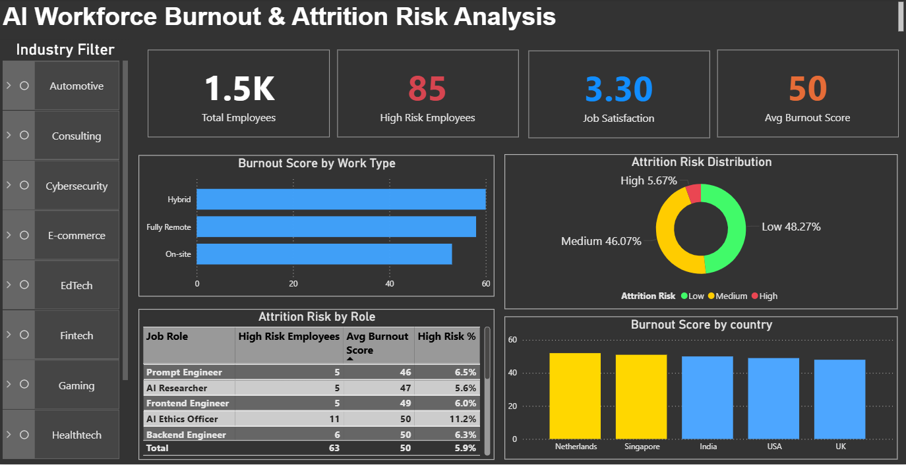

# ai-workforce-burnout-attrition-analysis
SQL and Power BI analysis of AI workforce burnout and attrition risk to identify high-risk roles, work patterns, and burnout drivers.

# AI Workforce Burnout & Attrition Risk Analysis

## Project Overview
This project analyzes burnout levels and attrition risk across AI roles by industry, work type, and country.  
The goal is to identify patterns that contribute to employee burnout and potential workforce attrition.

The project combines **SQL analysis and Power BI visualization** to generate actionable workforce insights.

---

## Tools Used
- SQL (MySQL)
- Power BI
- Data Visualization
- Workforce Analytics

---

## Key Metrics
- Total Employees
- High Risk Employees
- Job Satisfaction Score
- Average Burnout Score

---

## Key Insights
1. **Hybrid work environments show the highest burnout scores**, indicating workload or communication pressures.
2. **AI Ethics Officers and Data Analysts show higher attrition risk percentages**, suggesting stress-heavy responsibilities.
3. **Burnout levels vary across countries**, with Netherlands and Singapore showing slightly higher scores.

---
## Dashboard Preview

